# InstallAnywhere 2020 Proof of Concept

Proof-of-concept demonstrating InstallAnywhere 2020’s custom actions, upgrades, and UI customization. Includes two projects built with 2020 SP1 on Ubuntu 18; paths may differ on Windows.

## Main folder structure
---

```bash
.
├── IAClasses.zip
├── InstallerActions
├── README.md
├── SimpleTextEditor-1.0
├── SimpleTextEditor-1.1
├── get-lib.sh
├── lib
├── maven-tests
├── screenshots
├── simple-text-editor
└── vagrant-dev-env
```

### IAClasses.zip
---

This is a zip file distributed by InstallAnywhere which is required to compile any custom code to extend the installers.

In Windows, it will be available in the following path: "C:\Program Files (x86)\InstallAnywhere 2020\IAClasses.zip"

In Ubuntu, it will be available in the following path: "/home/vagrant/InstallAnywhere 2020/IAClasses.zip"

### InstallerActions
---

Custom Java project with InstallAnywhere actions. This project depends on IAClasses.zip and *commons-io-2.6* which can be downloaded by running get-lib.sh.

```bash
.
├── InstallerActions.iml
├── out
│   ├── artifacts
│   │   └── InstallerActions_jar
│   │       └── InstallerActions.jar
│   └── production
│       └── InstallerActions
│           ├── BackupUtils.class
│           ├── CustomJavaActionBase.class
│           ├── CustomJavaActionUpdate.class
│           └── VariablesUtils.class
└── src
    ├── BackupUtils.java
    ├── CustomJavaActionBase.java
    ├── CustomJavaActionUpdate.java
    ├── CustomPanelTest.java
    └── VariablesUtils.java
```

This project was compiled using Java JDK 1.8 with IntelliJ but other IDE could be used as well.

Link to the latest InstallAnywhere API Documentation:

https://docs.flexera.com/InstallAnywhereAPI/IA2015/javadoc/index.html

#### BackupUtils.java

A class created to backup a folder with some exceptions.

This class can handle backups via *InstallerProxy* on installing or *UninstallerProxy* on uninstalling.

https://docs.flexera.com/InstallAnywhereAPI/IA2015/javadoc/com/zerog/ia/api/pub/InstallerProxy.html

https://docs.flexera.com/InstallAnywhereAPI/IA2015/javadoc/com/zerog/ia/api/pub/UninstallerProxy.html

#### CustomJavaActionBase.java

This is an action class used by the base installer for version 1.0.

The method of interest of this class are *install* and *uninstall*.

Each one performs some logging operations to the user home.

The *install* method will write a text file with the current timestamp plus the word "installing_" and the version being installed.

The *uninstall* method will write a text file with the current timestamp plus the word "uninstalling_base_" and the version being uninstalled.

The *uninstall* method will perform a backup of the installation excluding the backup folder to avoid a recursive loop. The reason for this is that the upgrade installer will silently uninstall the base version and then will install the upgrade.

@todo: There has to be a way to check if the current installation is being uninstalled by another installer during an upgrade.

#### CustomJavaActionUpdate.java

This is an action class used by the upgrade installer for version 1.1.

The method of interest of this class are *install* and *uninstall*.

Each one performs some logging operations to the user home.

The *install* method will write a text file with the current timestamp plus the word "updating_to_" and the version being installed.

The *install* method will perform a backup of the installation excluding the backup folder to avoid a recursive loop. The reason for this is that the upgrade installer will silently uninstall the base version and then will install the upgrade.

The *uninstall* method will write a text file with the current timestamp plus the word "uninstalling_update_" and the version being uninstalled.

@todo: Similar to the CustomJavaActionBase class, this logic would help customers with their backups in case they are not satisfied with an upgrade. Perhaps it makes more sense to perform the backup during the install event of an upgrade. This is yet to be decided.

#### CustomPanelTest.java

This is a custom panel class that extends CustomCodePanel to demonstrate how to create custom UI panels during installation. This panel prompts users to enter database connection parameters (host, port, database name, username, and password) and stores these values as installer variables for use by the installation process.

The panel showcases how to:
- Create custom form fields with labels and text inputs
- Handle password fields with masked characters
- Validate user input before proceeding
- Set installer variables from user input
- Use InstallAnywhere's internationalization resources

This demonstrates InstallAnywhere's capability to gather user-specific configuration during installation.

#### VariablesUtils.java

This class was created to get some logging capabilities and debug the different variables used by an installer on installing time.

### SimpleTextEditor-1.0
---

InstallAnywhere 2020 project. This project has the configuration to build the installers for a simple base project found inside *simple-text-editor/SimpleTextEditor-1.0*

```bash
.
├── SimpleTextEditor-1.0.iap_xml
├── SimpleTextEditor-1.0_Build_Output
├── SimpleTextEditor-1.0locales_Default_Configuration
│   ├── ProjectLocalizationInfo.txt
│   └── custom_en
├── buildlog.xml
└── ia.credstore
```

The folder *SimpleTextEditor-1.0_Build_Output* is where the installers will be generated and is not included in the repository. It will be generated automatically by InstallAnywhere 2020.

The installers will be found inside the folder: SimpleTextEditor-1.0_Build_Output

The Windows installers will be found inside the folder:

SimpleTextEditor-1.0_Build_Output\Default_Configuration\Web_Installers\InstData\Windows\NoVM

### SimpleTextEditor-1.1
---

InstallAnywhere 2020 project. This project has the configuration to build the upgrade installers for a simple base project found inside *simple-text-editor/SimpleTextEditor-1.1*

```bash
.
├── SimpleTextEditor-1.1.iap_xml
├── SimpleTextEditor-1.1_Build_Output
├── SimpleTextEditor-1.1locales_Default_Configuration
│   ├── ProjectLocalizationInfo.txt
│   └── custom_en
├── buildlog.xml
└── ia.credstore
```

The folder *SimpleTextEditor-1.1_Build_Output* is where the installers will be generated and is not included in the repository. It will be generated automatically by InstallAnywhere 2020.

The installers will be found inside the folder: SimpleTextEditor-1.1_Build_Output

The Windows installers will be found inside the folder:

SimpleTextEditor-1.1_Build_Output\Default_Configuration\Web_Installers\InstData\Windows\NoVM

### get-lib.sh
---

This shell script will download *commons-io-2.6* which is required to compile the sample project inside the *simple-text-editor* folder.

### lib
---

This folder contains the library expected by the sample project.

### maven-tests
---

A simple Maven project demonstrating Maven build lifecycle and plugin executions. This project includes:

```bash
.
├── pom.xml
└── src
    ├── main
    │   └── java
    │       └── hello
    │           ├── Greeter.java
    │           └── HelloWorld.java
    └── test
        └── java
            └── hello
                └── GreeterTest.java
```

**Features:**
- Maven project with Java 8 compilation
- Joda Time dependency for date/time handling
- JUnit testing framework
- Custom Maven exec plugin configurations that run during test and install phases
- Demonstrates passing Maven properties as command line arguments

**Usage:**
- Run `mvn test` to execute the application during test phase
- Run `mvn install` to execute the application during install phase
- Maven properties `argumentA` and `argumentB` can be customized via command line

### simple-text-editor
---

Pair of simple Java projects used to generate the set of installers. This is the demo tool which is installed and / or upgraded.

```bash
.
├── SimpleTextEditor-1.0
│   ├── backups
│   ├── build.sh
│   ├── com
│   │   └── macrovision
│   │       └── test
│   │           └── SimpleTextEditor.java
│   ├── logs
│   ├── settings.properties
│   └── ste.bat
├── SimpleTextEditor-1.1
│   ├── backups
│   ├── build.sh
│   ├── com
│   │   └── macrovision
│   │       └── test
│   │           ├── SimpleTextEditor.java
│   │           └── util
│   │               └── Settings.java
│   ├── logs
│   ├── settings.xml
│   └── ste.bat
└── comparison of folders.WinMerge
```

#### SimpleTextEditor-1.0

Simple Java project of a text editor, version 1.0.

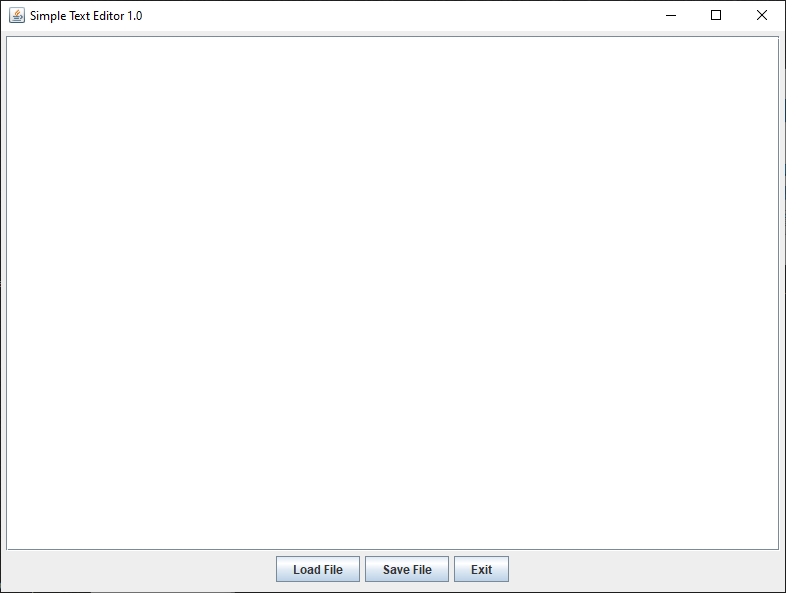

Since this is a very basic app, no framework was used. It can be compiled from the cli using build.sh.

#### SimpleTextEditor-1.1

Simple Java project of a text editor, version 1.1.

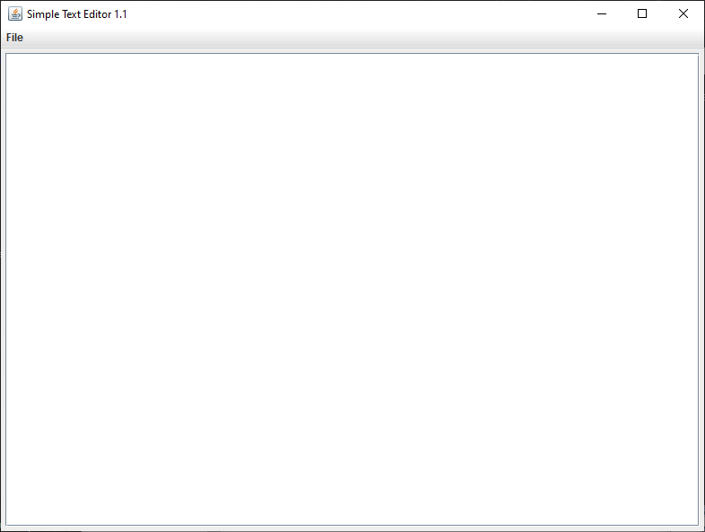

Since this is a very basic app, no framework was used. It can be compiled from the CLI using build.sh.

## What's different between version 1.0 and 1.1?

Version 1.0 of the Simple Text Editor uses a properties file to load settings compared to version 1.1 which uses XML files.

Both version 1.0 and version 1.1 have a bat file to open. Version 1.0 has an extra parameter on the bat file which is: -Xmx64m

This difference between bat files is to simulate possible user customizations on certain files such as Windows Batch Files or Shell Scripts.

The Java code between versions 1.0 and 1.1 has changed regarding UI and also related to how the settings are loaded.

### vagrant-dev-env

Inside this folder can be found the files required to provision a dev environment to install the InstalLAnywhere 2020 and InstallAnywhere 2020 SP1 tools in order to be able to open the InstallAnywhere project files from previous steps.

```bash
.
└── ia2020
    ├── Vagrantfile
    └── config.yaml
```

The following project can be cloned to run a virtual machine using the files mentioned above:

https://github.com/development-environments/hv-qa-environments

1) Clone https://github.com/development-environments/hv-qa-environments

2) Drop the ia2020 folder including the Vagrantfile and config.yaml file inside the folder ubuntu

https://github.com/development-environments/hv-qa-environments/tree/master/ubuntu

3) Open your console or terminal of choice and cd to the io2020 directory and run:

```bash
vagrant up
```

The machine will provision and then you will be able to drop the bin files in the shared folder:

https://github.com/development-environments/hv-qa-environments/tree/master/shared

It is assumed that the user has the installer files.

With the InstallAnywhere 2020 and InstallAnywhere 2020 SP1 files in the shared folder, you will be able to install InstallAnywhere and open the projects.

The shared folder can also be used to clone the current project and it's advised to do it.

## Install and upgrade process

### Install
***

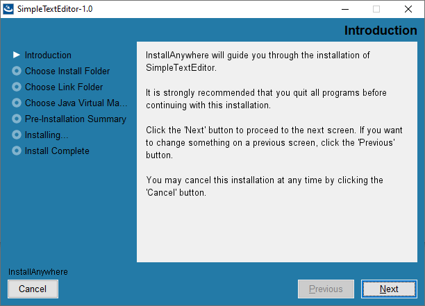

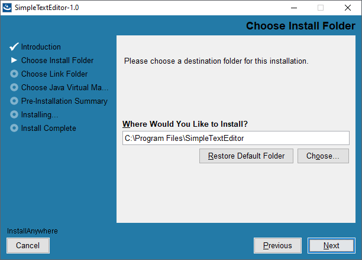


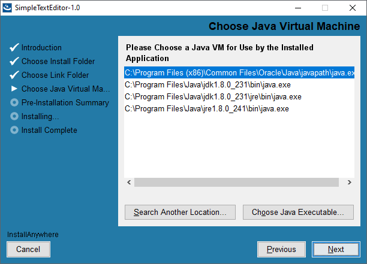

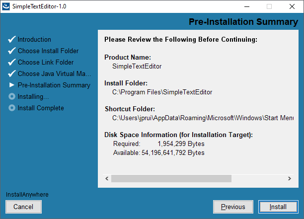


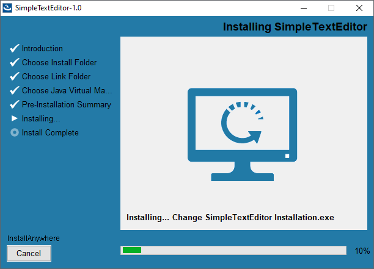

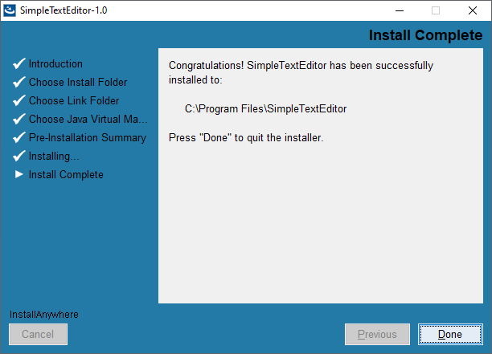

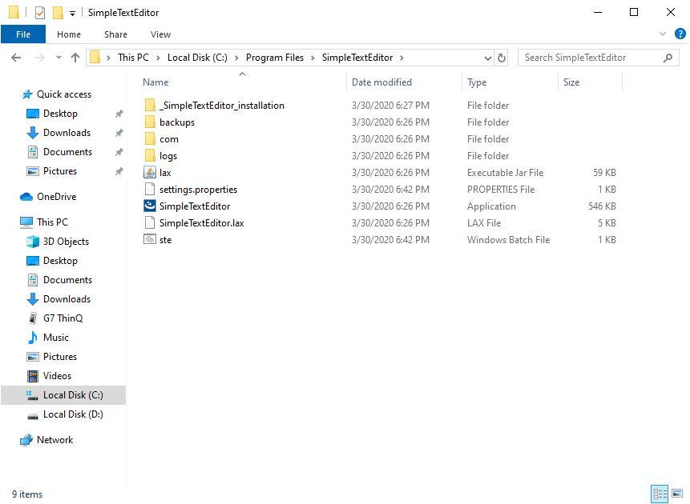

### Upgrade
***


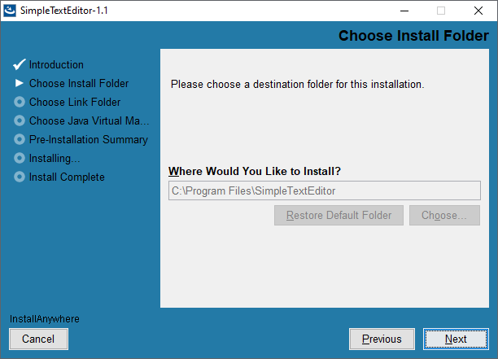

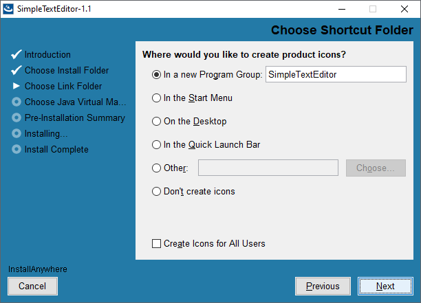

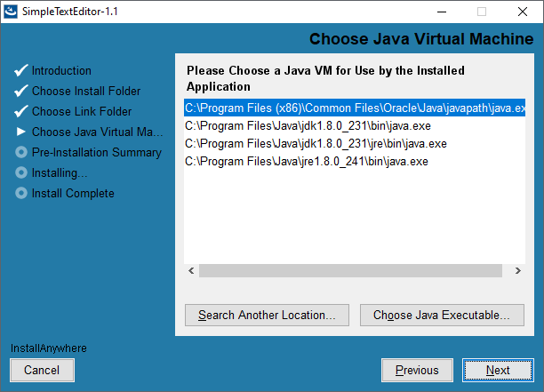


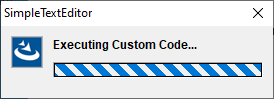

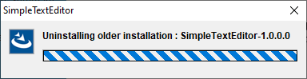

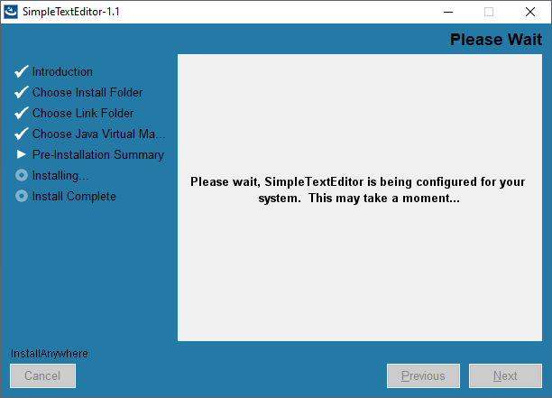


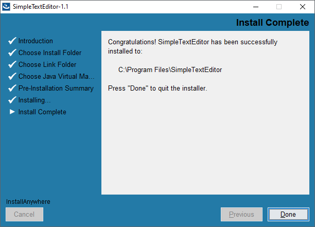

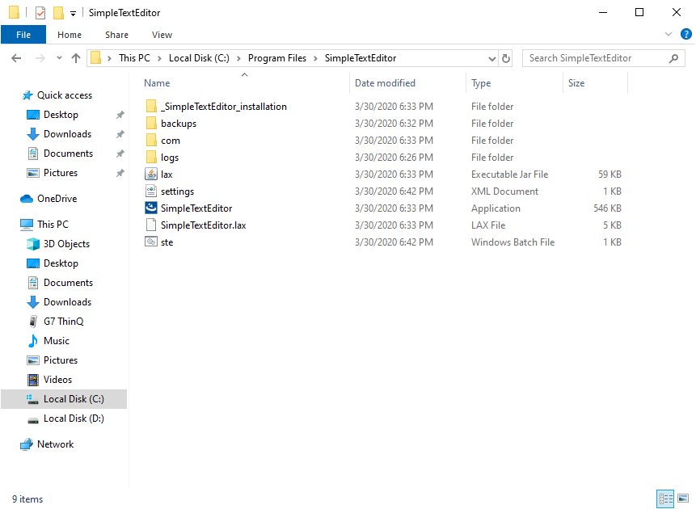

### Backups folder
***

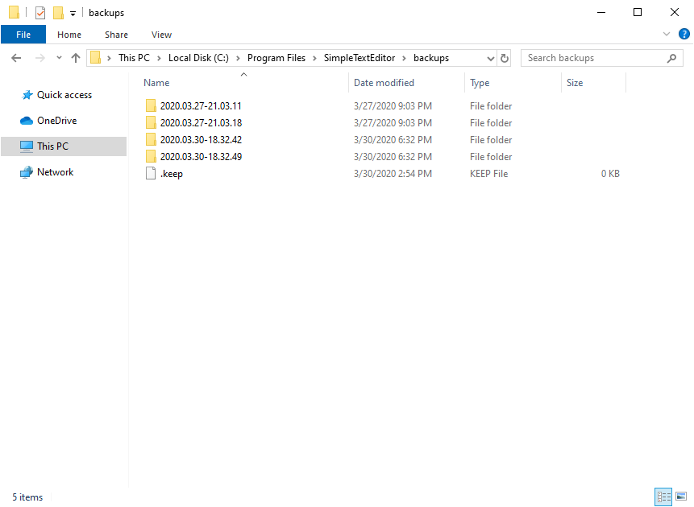

### Logs folder
***

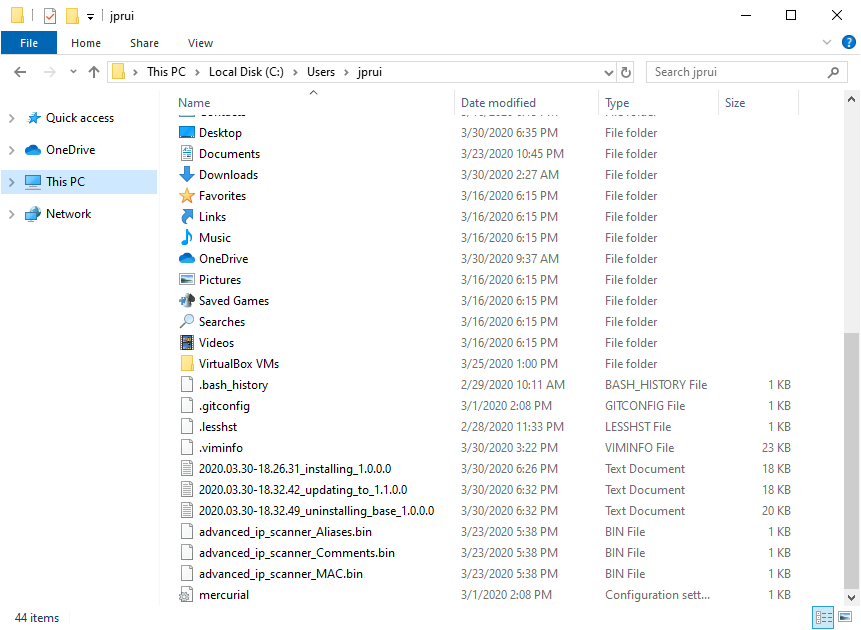

## Next steps

- Add features to check if services are running and stop them
- Uninstall previous installations built with older InstallAnywhere versions
- Customize the installer UI to allow users specify paths and custom actions extending CustomCodePanel:
  https://docs.flexera.com/InstallAnywhereAPI/IA2015/javadoc/com/zerog/ia/api/pub/CustomCodePanel.html
- Generate macOS installers
